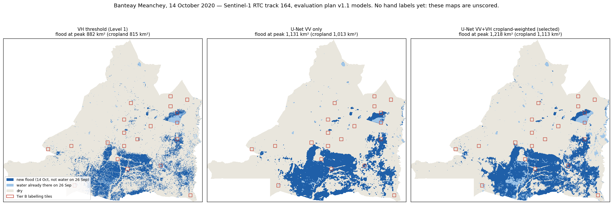

# Mekong Flood Intelligence: summary

**Author:** Sobotra · **Written:** 29 September 2026 · **Reading time:** about 5 minutes

This page covers the whole project. Every number is copied from a file under `results/`. If a number here disagrees with that file, the file is correct. The detailed documents are linked in each section.

---

## The question

Radar flood maps use a simple rule: **calm water reflects the radar pulse away from the satellite, so water looks dark.** Flooded rice breaks that rule. When water sits under a standing crop, the pulse bounces off the water surface, hits the stems and returns to the satellite (*double bounce*). The flooded field then looks **bright**, as bright as dry land. Threshold-based flood maps therefore miss flooded rice, and flooded rice is the flood that matters most for Cambodian farmers.

**Hypothesis (pre-registered in `evaluation_plan.md` before any training):** a model that uses spatial context, meaning the shape and surroundings of a field, can recover bright flooded cropland that a threshold misses, without buying that gain by over-detecting dry fields.

## Method

| Step | What was done | Detail |
| --- | --- | --- |
| Data | Sen1Floods11: 11 flood events with hand-drawn labels. **All Cambodia chips held out as the test set**; the split is by event, never by chip. | [level0_inventory.md](level0_inventory.md) |
| Baseline | One global VH threshold (−19.65 dB), fitted on training events only. | [level1_baseline.md](level1_baseline.md) |
| Failure analysis | Measured *what* the threshold misses and whether any single pixel value can separate it. | [level2_failure_analysis.md](level2_failure_analysis.md) |
| Hypothesis test | U-Nets against per-pixel controls. Pass criteria frozen in advance, model selected on validation data, test scored once. | [level3_results_v11.md](level3_results_v11.md) |
| Real event | Mapped the October 2020 flood in Banteay Meanchey province and scored the maps against Cambodian labels drawn by hand for this project. | [level4_cambodia.md](level4_cambodia.md), [level4_tierb_scores.md](level4_tierb_scores.md) |

Every score is reported per land type (cropland, vegetation, open water, built-up), never only as one pooled number.

## Findings

### 1. Per-pixel brightness cannot find bright flooded rice. Spatial context can.

At Level 2, bright flooded cropland could not be told apart from dry cropland by any single radar value: AUC ≈ 0.5 on VV, on VH and on their ratio. That made a per-pixel control mandatory. Without it, a gain from the U-Net could not be attributed to spatial context.

Result on the held-out Cambodia benchmark chips (Level 3, plan v1.1):

| | Threshold | Best per-pixel control | **Selected U-Net** | Required |
| --- | --- | --- | --- | --- |
| Bright flooded cropland recall | 0.342 | 0.239 | **0.790** | ≥ 0.50 |
| Bright flooded vegetation recall | 0.280 | 0.216 | **0.754** | ≥ 0.50 |
| Cropland precision | 0.876 | 0.869 | **0.827** | ≥ 0.75 |
| All-water IoU | 0.727 | 0.756 | **0.797** | ≥ 0.765 |

**All six frozen criteria passed, so the hypothesis is confirmed.** The per-pixel control, given the same inputs, reaches 0.239. The gain therefore comes from spatial context. The selected model is `unet_vvvh_cropw`: a U-Net on VV + VH with flooded cropland and vegetation weighted ×4 in the loss. The verdict also holds under the alternative definition of "bright" that the plan text used (B 0.716, V 0.730).

### 2. A model is only valid on the processing chain it was trained on.

The first confirmed model (plan v1.0) collapsed from IoU 0.820 to 0.138 when it was fed the same Cambodian scene from a different radar processing chain. That was measured before anything was claimed about Cambodia ([level4_pipeline_switch.md](level4_pipeline_switch.md)). The benchmark was rebuilt on the Level 4 pipeline and the whole test was re-run under a versioned plan (v1.1). The hypothesis was confirmed again.

### 3. October 2020 was a real flood, not normal paddy water.

On the peak date (14 October 2020), flood extent in the province was **882 / 1,131 / 1,218 km²** (threshold / VV-only U-Net / selected U-Net). The same track and dates in 2018, 2019, 2021 and 2022 give a median several times smaller. The 2020 flood on cropland is **3.9–6.0× a normal year**.

### 4. On Cambodian ground, the benchmark ranking holds.

Scored against 95 water polygons that the author confirmed by hand on the flood date, with rice near harvest:

| Cropland, total water | Threshold | VV-only U-Net | **Selected U-Net** |
| --- | --- | --- | --- |
| IoU | 0.498 | 0.612 | **0.713** |
| Recall | 0.553 | 0.669 | **0.801** |
| Precision | 0.835 | 0.879 | 0.867 |

The selected model finds **about 45 % more of the flooded cropland** than the threshold at the same precision. The model was chosen on other countries' floods under criteria fixed in advance, and it transferred to a different country, season and crop stage.

## Limits

1. **The Cambodian labels cannot see water hidden under the rice canopy.** They were seeded from an optical water index and then filtered by hand, and optical imagery cannot see through a closed canopy. So the Level 4 result proves that the model finds more *visible* flood water than a threshold. It does **not** yet prove that the model finds *hidden* flood water, which is the case the project was built for. Flooded-vegetation recall against these labels must not be quoted either way. This is the main open gap.
2. **The benchmark test scene is the wrong crop stage.** The Cambodian benchmark scene is from August 2018, when the rice is young, and only 2.3 % of its flooded cropland is bright. Level 3 therefore tests the bright case mostly on other countries' floods. Only Level 4 is on Cambodian rice near harvest.
3. **The selected model over-detects outside cropland.** It has about 4× the cropland false positives of the VV-only U-Net on the benchmark, and the lowest overall precision on the Cambodian labels (0.525). **For cropland use the selected model; for a general flood map use the VV-only U-Net.**
4. **Mapped flood area is larger than the official figure.** The reported figure is 282 km² of rice inundated. Mapped flood on cropland is 2.9–3.9× that, and the excess over a normal year is still 2.2–3.3×. The two figures probably measure different things (damage assessed per district versus water seen in every pixel on one morning), but this is not resolved.
5. **Small evidence base.** There was one labeller (no agreement score), 17 tiles of 4 km² each, 5.8 km² of labelled water, and one training seed. Only the cropland numbers have enough pixels to quote.

## What was done to keep the result honest

- Pass criteria were written and committed **before** training (`evaluation_plan.md`, frozen). The commit dates are the evidence.
- Models were selected on validation data only, and the selection was logged and committed before test scoring. `scripts/level3_test.py` refuses to run otherwise.
- Changes to the plan (v1.0 → v1.1) were versioned, dated and justified by a measurement.
- Test data was never used for tuning. Cambodia was never in training.
- Every number is generated from code, and every figure is generated from a results file.
- An independent reviewer (a second AI) audited the work at several stages and found real bugs, which were fixed.

## What would strengthen it next

1. **Labels for hidden water.** Polygons drawn from terrain and hydrology (low ground next to confirmed water) rather than from optical imagery. This closes limit 1 and is the single most valuable next step.
2. A second labeller on 5 tiles, to measure agreement between labellers.
3. A decision-ready flood report for the province (plan Level 7) that states limits 1 and 4 alongside the areas.
