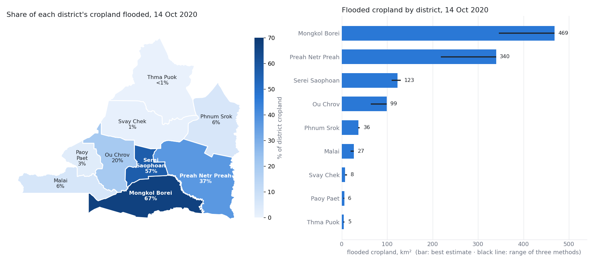

# Flood report: Banteay Meanchey, October 2020

*Generated by `scripts/level7_report.py` from the results files; do not edit by hand.*
*Numbers: `results/level7/report.json`, `results/level7/districts.csv`.*

```
Flood event — Banteay Meanchey province, Cambodia
Detected:                  14 Oct 2020  (Sentinel-1 radar, ~06:00 local)
Flooded area:              1,218 km²   (range 882–1,218)
  of which cropland:       1,113 km²   (range 816–1,113) = 21 % of the province's cropland
Change since last pass:    +1,185 km² of water since 26 Sep 2020
Two weeks later:           950 km² of cropland flooded on 1 Nov 2020
Compared with normal:      6.0× the flooded cropland of a normal October (range 3.9–6.0×)
Method:                    Sentinel-1 VV+VH, U-Net (cropland-weighted)
Known limitation:          on cropland it found 80 % of the flood water that people could
                           see in satellite photos, and 87 % of what it called flood was flood.
                           Water hidden under the rice canopy is NOT checked (see below).
```

## Where the flooding is

**Three districts hold 84 % of the flooded cropland:** Mongkol Borei (469 km²), Preah Netr Preah (340 km²), Serei Saophoan (123 km²). All three methods rank the same four districts at the top, in the same order.



| District | Cropland flooded, km² | Range (3 methods) | Share of district's cropland | Flooded on 1 Nov 2020, km² |
| --- | --- | --- | --- | --- |
| Mongkol Borei | **469** | 346–469 | 67 % | 395 |
| Preah Netr Preah | **340** | 218–340 | 37 % | 403 |
| Serei Saophoan | **123** | 110–130 | 57 % | 76 |
| Ou Chrov | **99** | 64–99 | 20 % | 16 |
| Phnum Srok | **36** | 36–40 | 6 % | 45 |
| Malai | **27** | 19–27 | 6 % | 5 |
| Svay Chek | **8** | 8–11 | 1 % | 4 |
| Paoy Paet | **6** | 4–6 | 3 % | 5 |
| Thma Puok | **5** | 4–6 | < 1 % | 1 |

On 1 Nov 2020, 85 % as much cropland was flooded as at the peak. In **Preah Netr Preah and Phnum Srok** it was *larger* than at the peak, so water there was still spreading or not draining. The northern and western districts (Thma Puok, Svay Chek, Paoy Paet) show almost no flooding.

## How far to trust these numbers

| Question | Answer | Evidence |
| --- | --- | --- |
| Is this a real flood, not normal wet-season paddy water? | **Yes.** Flooded cropland is 3.9–6.0× the same date in 2018, 2019, 2021 and 2022. | [level4_cambodia.md §3b](level4_cambodia.md) |
| Is the cropland number accurate? | **Mostly.** Checked against 17 hand-labelled sites: it finds 80 % of visible flood water on cropland; 87 % of its cropland flood is real. A simple threshold finds only 55 %. | [level4_tierb_scores.md](level4_tierb_scores.md) |
| Is the forest and grassland number accurate? | **No, do not use it.** 87 km² is mapped there, but on the hand-labelled sites under about 4 % of it could be confirmed. | [level4_tierb_scores.md](level4_tierb_scores.md) |
| Does it find water hidden under tall rice? | **Unknown.** Photos cannot see under the canopy, and free terrain data is too coarse to tell (the cropland is flat to within about 1.5 m). | [level4_tierb_scores.md §5](level4_tierb_scores.md) |
| Does it agree with the official figure? | **No.** The reported figure is 282 km² of rice inundated; this map gives 3.9× that. Even the flooding *above a normal year* (927 km²) is 3.3× that. The two probably measure different things (damage assessed per district, versus all water seen on one morning), but this is not resolved. | [level4_cambodia.md §3](level4_cambodia.md) |

## How to use it

- **Use it to rank districts** and to see where water was still standing two weeks later. All three methods agree on which districts are worst, so this is the most reliable part of this report.
- **Use the cropland area as an upper-end estimate**, with the range beside it. Do not quote it as rice *damaged*: water on a field is not the same as a lost crop.
- **Do not use** the forest and grassland area, or any figure for a single village. The map is 20 m, and it was checked on 17 sites of 4 km² each, not everywhere.

## How it was made

Sentinel-1 radar passes on 26 Sep 2020 (before), 14 Oct 2020 (peak) and 1 Nov 2020 (after), track 164, covering 100 % of the province. Flood = water on the date that was not water before. The model was chosen on floods in other countries, under rules written down before it was trained, and then checked on Cambodian ground ([SUMMARY.md](SUMMARY.md)). District boundaries: geoBoundaries (Open Development Cambodia, 2014, CC BY 4.0). Cropland: ESA WorldCover 2020, which does not separate rice from other crops.
