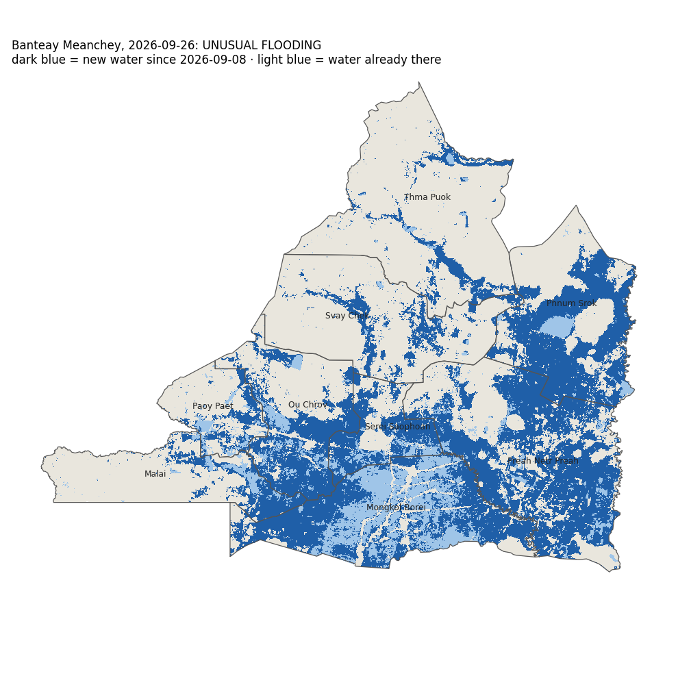

# Flood check: Banteay Meanchey, 2026-09-26

## UNUSUAL FLOODING

Flooded cropland: **1,998 km²**. The same dates in the previous 3 years had a median of **529 km²** (3.8×). Rule: 'unusual' means more than 2× the usual amount and more than 50 km². 3 of 3 methods give this verdict.

| | 2026-09-26 | 2025 | 2024 | 2023 |
| --- | --- | --- | --- | --- |
| VH threshold: flooded cropland, km² | 1,326 | 627 | 220 | 143 |
| U-Net VV only: flooded cropland, km² | 1,623 | 668 | 257 | 152 |
| U-Net VV+VH (selected): flooded cropland, km² | 1,998 | 722 | 529 | 312 |

**Flooded cropland by district** (selected model):

| District | km² | share of district's cropland |
| --- | --- | --- |
| Preah Netr Preah | 576 | 62 % |
| Mongkol Borei | 369 | 53 % |
| Phnum Srok | 346 | 55 % |
| Ou Chrov | 230 | 47 % |
| Serei Saophoan | 134 | 62 % |
| Svay Chek | 113 | 16 % |
| Thma Puok | 91 | 9 % |
| Malai | 88 | 21 % |
| Paoy Paet | 49 | 26 % |

## Read before using

- Radar passes: 2026-09-08 (before) and 2026-09-26, track 164 descending. The radar saw 100 % of the province.
- 'Flood' = water on the date that was not water on the 'before' date. Water that was already there before is not counted, so a flood that started before the 'before' date is under-counted.
- Accuracy was measured once, on the October 2020 flood: on cropland the selected model found 74 % of the flood water people could see in photos, and 89 % of what it called flood was flood. Forest and grassland numbers are not reliable. Water hidden under tall rice was not checked. See `docs/level7_report.md`.
- These passes include sentinel-1c, sentinel-1d. The models were trained and tested on Sentinel-1A/1B only. The newer satellites carry the same radar design, but this project has not measured them, so treat the numbers with extra caution.
