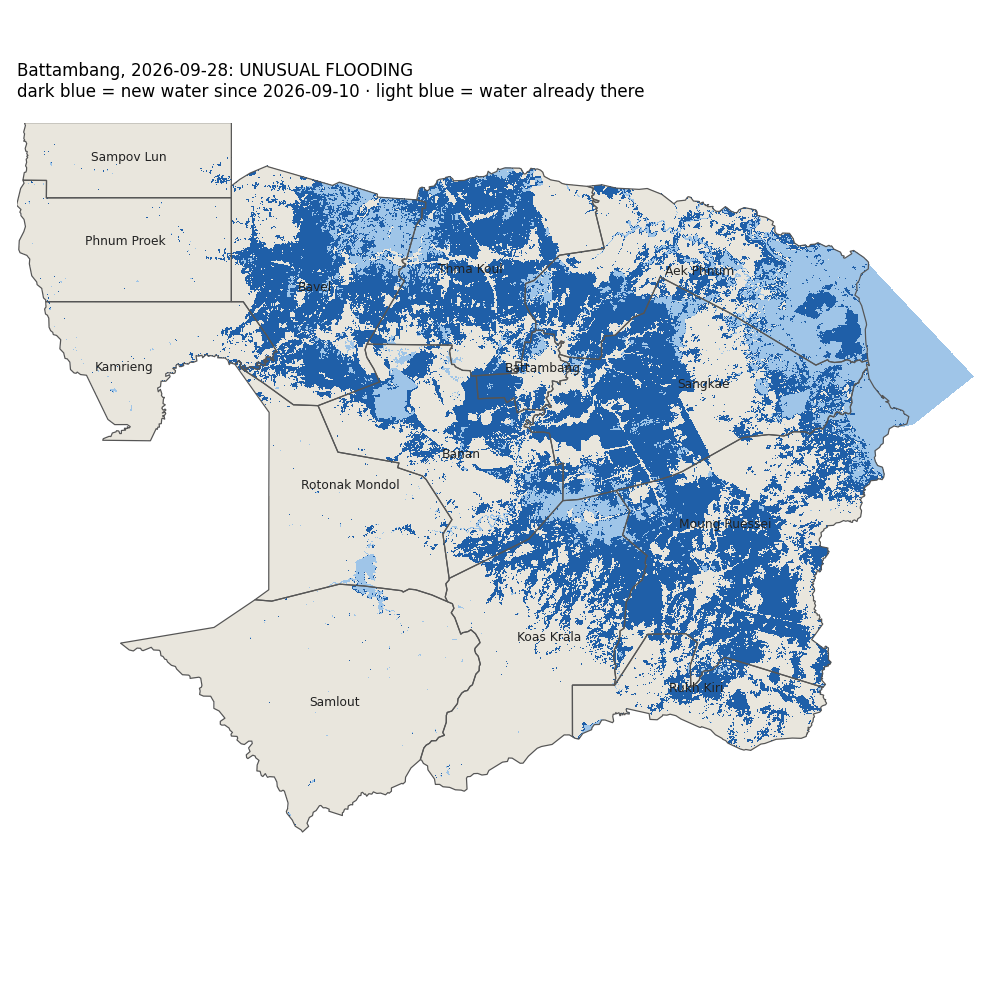

# Flood check: Battambang, 2026-09-28

## UNUSUAL FLOODING

Flooded cropland: **2,881 km²**. The same dates in the previous 2 years had a median of **619 km²** (4.7×). Rule: 'unusual' means more than 2× the usual amount and more than 50 km². 3 of 3 methods give this verdict.

| | 2026-09-28 | 2025 | 2024 |
| --- | --- | --- | --- |
| VH threshold: flooded cropland, km² | 2,011 | 606 | 104 |
| U-Net VV only: flooded cropland, km² | 2,004 | 393 | 69 |
| U-Net VV+VH (selected): flooded cropland, km² | 2,881 | 1,000 | 238 |

**Flooded cropland by district** (selected model):

| District | km² | share of district's cropland |
| --- | --- | --- |
| Moung Ruessei | 600 | 68 % |
| Bavel | 497 | 55 % |
| Thma Koul | 473 | 69 % |
| Sangkae | 422 | 79 % |
| Banan | 272 | 40 % |
| Koas Krala | 246 | 34 % |
| Aek Phnum | 158 | 79 % |
| Rukh Kiri | 124 | 32 % |
| Battambang | 50 | 71 % |
| Kamrieng | 20 | 5 % |
| Rotonak Mondol | 10 | 2 % |
| Sampov Lun | 4 | < 1 % |
| Phnum Proek | 3 | < 1 % |
| Samlout | 2 | < 1 % |

## Read before using

- Radar passes: 2026-09-10 (before) and 2026-09-28, track 99 ascending. The radar saw 100 % of the province.
- 'Flood' = water on the date that was not water on the 'before' date. Water that was already there before is not counted, so a flood that started before the 'before' date is under-counted.
- Accuracy was measured once, on the October 2020 flood: on cropland the selected model found 74 % of the flood water people could see in photos, and 89 % of what it called flood was flood. Forest and grassland numbers are not reliable. Water hidden under tall rice was not checked. See `docs/level7_report.md`.
- **Battambang has never been checked against hand labels.** That accuracy was measured in Banteay Meanchey only; here the model is used as it is, without a score.
- This track passes in the evening (~18:20 local). The Cambodia work used the morning pass, when water is usually calmer; wind can roughen water and hide it from radar.
- These passes include sentinel-1c, sentinel-1d. The models were trained and tested on Sentinel-1A/1B only. The newer satellites carry the same radar design, but this project has not measured them, so treat the numbers with extra caution.
